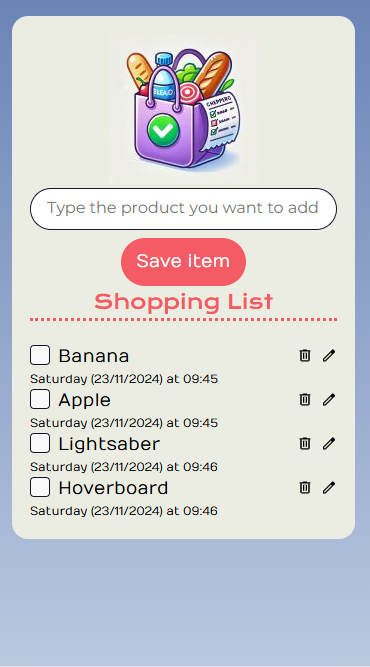

# Shopping List


This web application was built as part of the Alura course **JavaScript: building dynamic pages**. It follows the course content with modifications. <br>The deployment was done using **Vercel**, ensuring smooth and fast hosting.


## 🌐 Live Demo
Explore the application live at: [Shopping List](https://shopping-list-wine-eta.vercel.app/)

## 🖼️ Preview



## 🔨 Project Features
- Add, edit, and delete items dynamically.
- Mark items as purchased or not.
- Display creation date and time for each item.
- Separate purchased items from the main list.


## ✔️ Technologies Used
- **HTML**: For structuring the web page.
- **CSS**: For styling, including **Bootstrap** for responsive design.
- **JavaScript**: For interactive elements and **DOM manipulation**.
  - **SweetAlert2**: For creating modern and customizable alerts.


## 📂 Project Structure
- **index.html**: The main HTML file that provides the structure and content of the web page.
- **styles.css**: Contains all the styles applied to the application, including custom styles for visual consistency.
- **script.js**: The primary JavaScript file responsible for core interactivity, such as handling events and updating the DOM.
- **/js/**: Directory containing modular JavaScript files that manage individual features (e.g., adding items, editing items, managing the list).
- **/img/**: Directory for storing image assets used in the project, such as icons or illustrations.

```bash
├── index.html              # The main HTML file, providing content and structure
├── styles.css              # Custom styles and layout rules for the application
├── script.js               # The primary JavaScript file for interactivity and DOM updates
├── js/                     # Directory for modular JavaScript files
│   ├── createListItem.js   # Handles the creation of list items
│   ├── checkEmptyList.js   # Checks if the shopping list is empty
│   ├── checkBoughtList.js  # Checks if the bought list is empty
│   ├── localStorageHandler.js  # Manages saving and retrieving data from LocalStorage
│   ├── generateWeekday.js  # Generates formatted weekday strings
│   ├── img/                    # Directory for image assets (icons, backgrounds, etc.)
└── README.md               # Documentation file for the project
```

## Installation
To run this project locally:

1. Clone the repository and navigate to the project directory:
   ```sh
   git clone https://github.com/vicmazzola/shopping-list
   cd shopping-list
   ```

2. Install dependencies:
```
npm install
```
3. Start the development server:
```
npm run dev
```


## 🚀 Deployment
The project was deployed using **Vercel**, ensuring fast and reliable hosting.
